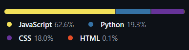

<h1 align="center">Hi 👋, I'm Dipanjan Chowdhury</h1>
<h3 align="center">A passionate Full-Stack Developer from India</h3>

## 💫 About Me:
🔭 I’m currently working on: **EMS for Small Business - A Full-Stack Employee Management System (React, Flask, MySQL)**

🌱 I’m currently learning: **Advanced Python, Advanced Flask, REST APIs, Advanced SQL**

👯 I’m looking to collaborate on: **Full-stack web development projects with React, Flask, and MySQL**

🤝 I’m looking for help with: **Full-Stack Web Development**

👨‍💻 All of my projects are available at: **[https://vercel.com/dipanjan-chowdhurys-projects](https://vercel.com/dipanjan-chowdhurys-projects)**

💬 Ask me about: **Full-Stack Web Development, React, Flask, MySQL, REST APIs, Authentication**

📫 How to reach me: **chowdhurydipanjan2000@gmail.com**

⚡ Fun fact: **I love turning coffee into code ☕💻**

## 🌐 Socials:
  

## 💻 Tech Stack:
               

## 📊 Most Used Languages:

  <picture>
    <!-- Dark mode -->
    <source srcset="assets/top-langs-dark.png" media="(prefers-color-scheme: dark)" />
    <!-- Light mode -->
    <source srcset="assets/top-langs-light.png" media="(prefers-color-scheme: light)" />
    <!-- Default (if none applies) -->
    
  </picture>

<!-- Proudly created with GPRM ( https://gprm.itsvg.in ) -->
